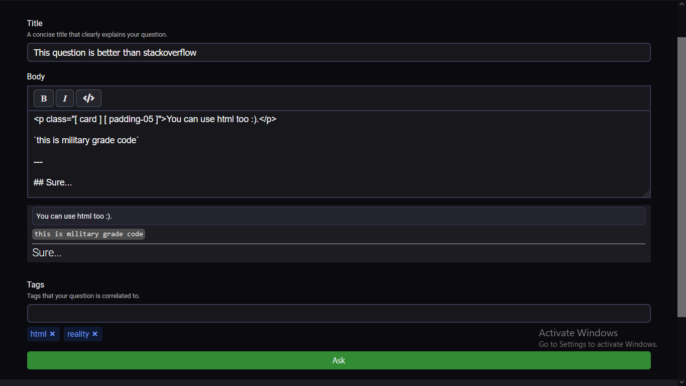
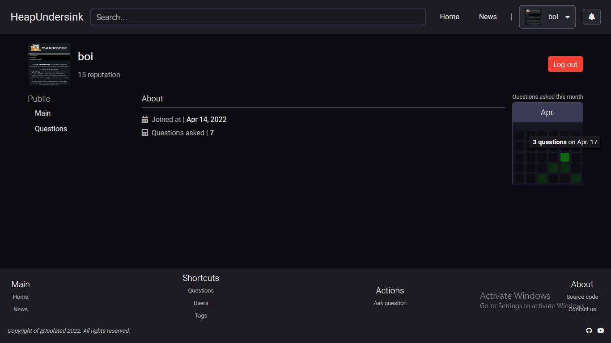

# HeapUnderSink

**x = "StackOverFlow"**

Similiar to { x } but under it's league!

## Features (WIP)
- *Most* features that { x } has.

### Tech
This project uses 2 main technologies and a methodology.
- [https://reactjs.org/](React) -> Frontend framework.
- [https://www.typescriptlang.org/](TypeScript) -> JS but better.
- [https://www.djangoproject.com/](Django) -> Backend framework.
- [https://cube.fyi/](CUBE-CSS) -> CSS methodology to help this project not be abandoned.
- [https://postcss.org/](PostCSS) -> Makes CSS more enjoyable :)

#### Screenshots
**Questions**
---

**Question**
---

**Tags**
---

**Ask a question**
---

**Register**
---

**View users**
---
